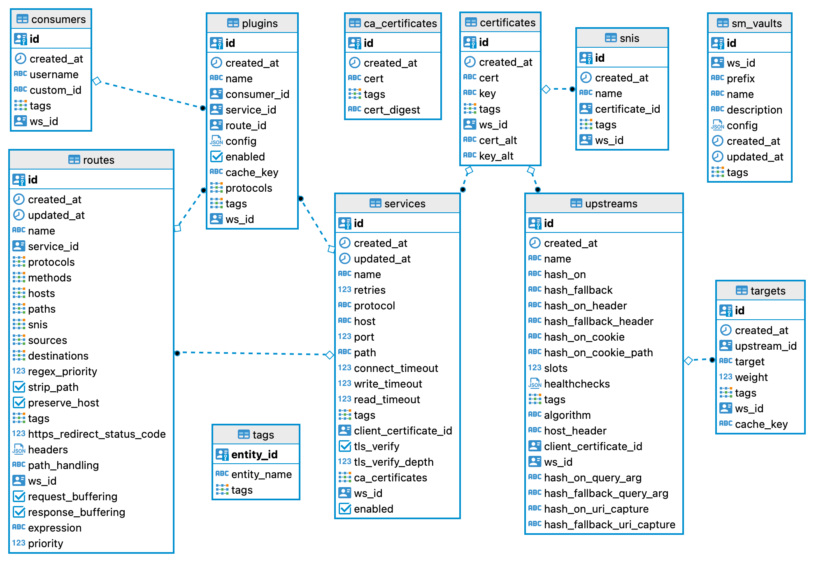

# Kong Admin APIのオブジェクトごとの整理
Kong Gateway(OSS)の設定情報は、下のER図に表現されるオブジェクトごとに定義されたテーブルに保存されます。

* PostgreSQL上に生成されたkongデータベースから[DBeaver](https://dbeaver.io/)を使って該当テーブルをピックアップしER図化しました
* テーブル定義は[Kongのマイグレーション用LUAファイル](https://github.com/Kong/kong/blob/master/kong/db/migrations/core/000_base.lua)に見ることができます

一方、Kong Admin APIは、このテーブルをうまくCRUD操作するようAPI化されており、それらはオブジェクトごとにまとめることができるので、以下にオブジェクトごとのKong Admin APIのメソッドとパス、公式ドキュメントへのリンクを表であらわします。

Serviceオブジェクト

|Name|Method|Path|
|:-|:-|:-|
|[1-1_list-all-services](https://docs.konghq.com/gateway/3.0.x/admin-api/#list-all-services)|GET|/services|
|[1-2_create-service](https://docs.konghq.com/gateway/3.0.x/admin-api/#create-service)|POST|/services|
|[1-3_retrieve-service](https://docs.konghq.com/gateway/3.0.x/admin-api/#retrieve-service-1)|GET|/services/{service name or id}|
|[1-4_create-or-update-service](https://docs.konghq.com/gateway/3.0.x/admin-api/#create-or-update-service)|PUT|/services/{service name or id}|
|[1-5_update-service](https://docs.konghq.com/gateway/3.0.x/admin-api/#update-service-1)|PATCH|/services/{service name or id}|
|[1-6_delete-service](https://docs.konghq.com/gateway/3.0.x/admin-api/#delete-service-1)|DELETE|/services/{service name or id}|
|[1-7_list-services-associated-to-a-specific-certificate](https://docs.konghq.com/gateway/3.0.x/admin-api/#list-services-associated-to-a-specific-certificate)|GET|/certificates/{certificate name or id}/services|
|[1-8_create-service-associated-to-a-specific-certificate](https://docs.konghq.com/gateway/3.0.x/admin-api/#create-service-associated-to-a-specific-certificate)|POST|/certificates/{certificate name or id}/services|
|[1-9_retrieve-service-associated-to-a-specific-certificate](https://docs.konghq.com/gateway/3.0.x/admin-api/#retrieve-service-associated-to-a-specific-certificate)|GET|/certificates/{certificate id}/services/{service name or id}|
|[1-10_create-or-update-service-associated-to-a-specific-certificate](https://docs.konghq.com/gateway/3.0.x/admin-api/#create-or-update-service-associated-to-a-specific-certificate)|PUT|/certificates/{certificate id}/services/{service name or id}|
|[1-11_update-service-associated-to-a-specific-certificate](https://docs.konghq.com/gateway/3.0.x/admin-api/#update-service-associated-to-a-specific-certificate)|PATCH|/certificates/{certificate id}/services/{service name or id}|
|[1-12_delete-service-associated-to-a-specific-certificate](https://docs.konghq.com/gateway/3.0.x/admin-api/#delete-service-associated-to-a-specific-certificate)|DELETE|/certificates/{certificate id}/services/{service name or id}|
|[1-13_retrieve-service-associated-to-a-specific-route](https://docs.konghq.com/gateway/3.0.x/admin-api/#retrieve-service-associated-to-a-specific-route)|GET|/routes/{route name or id}/service|
|[1-14_create-or-update-service-associated-to-a-specific-route](https://docs.konghq.com/gateway/latest/admin-api/#create-or-update-service-associated-to-a-specific-route)|PUT|/routes/{route name or id}/service|
|[1-15_update-service-associated-to-a-specific-route](https://docs.konghq.com/gateway/3.0.x/admin-api/#update-service-associated-to-a-specific-route)|PATCH|/routes/{route name or id}/service|
|[1-16_retrieve-service-associated-to-a-specific-plugin](https://docs.konghq.com/gateway/3.0.x/admin-api/#retrieve-service-associated-to-a-specific-plugin)|GET|/plugins/{plugin id}/service|
|[1-17_create-or-update-service-associated-to-a-specific-plugin](https://docs.konghq.com/gateway/3.0.x/admin-api/#create-or-update-service-associated-to-a-specific-plugin)|PUT|/plugins/{plugin id}/service|
|[1-18_update-service-associated-to-a-specific-plugin](https://docs.konghq.com/gateway/3.0.x/admin-api/#update-service-associated-to-a-specific-plugin)|PATCH|/plugins/{plugin id}/service|

Routeオブジェクト

|Name|Method|Path|
|:-|:-|:-|
|[2-1_list-all-routes](https://docs.konghq.com/gateway/3.0.x/admin-api/#list-all-routes)|GET|/routes|
|[2-2_create-route](https://docs.konghq.com/gateway/3.0.x/admin-api/#create-route)|POST|/routes|
|[2-3_retrieve-route](https://docs.konghq.com/gateway/3.0.x/admin-api/#retrieve-route-1)|GET|/routes/{route name or id}|
|[2-4_create-or-update-route](https://docs.konghq.com/gateway/3.0.x/admin-api/#create-or-update-route)|PUT|/routes/{route name or id}|
|[2-5_update-route](https://docs.konghq.com/gateway/3.0.x/admin-api/#update-route-1)|PATCH|/routes/{route name or id}|
|[2-6_delete-route](https://docs.konghq.com/gateway/3.0.x/admin-api/#delete-route-1)|DELETE|/routes/{route name or id}|
|[2-7_list-routes-associated-to-a-specific-service](https://docs.konghq.com/gateway/3.0.x/admin-api/#list-routes-associated-to-a-specific-service)|GET|/services/{service name or id}/routes|
|[2-8_create-route-associated-to-a-specific-service](https://docs.konghq.com/gateway/3.0.x/admin-api/#create-route-associated-to-a-specific-service)|POST|/services/{service name or id}/routes|
|[2-9_retrieve-route-associated-to-a-specific-service](https://docs.konghq.com/gateway/3.0.x/admin-api/#retrieve-route-associated-to-a-specific-service)|GET|/services/{service name or id}/routes/{route name or id}|
|[2-10_create-or-update-route-associated-to-a-specific-service](https://docs.konghq.com/gateway/3.0.x/admin-api/#create-or-update-route-associated-to-a-specific-service)|PUT|/services/{service name or id}/routes/{route name or id}|
|[2-11_update-route-associated-to-a-specific-service](https://docs.konghq.com/gateway/3.0.x/admin-api/#update-route-associated-to-a-specific-service)|PATCH|/services/{service name or id}/routes/{route name or id}|
|[2-12_delete-route-associated-to-a-specific-service](https://docs.konghq.com/gateway/3.0.x/admin-api/#delete-route-associated-to-a-specific-service)|DELETE|/services/{service name or id}/routes/{route name or id}|
|[2-13_retrieve-route-associated-to-a-specific-plugin](https://docs.konghq.com/gateway/3.0.x/admin-api/#retrieve-route-associated-to-a-specific-plugin)|GET|/plugins/{plugin id}/route|
|[2-14_create-or-update-route-associated-to-a-specific-plugin](https://docs.konghq.com/gateway/3.0.x/admin-api/#create-or-update-route-associated-to-a-specific-plugin)|PUT|/plugins/{plugin id}/route|
|[2-15_update-route-associated-to-a-specific-plugin](https://docs.konghq.com/gateway/3.0.x/admin-api/#update-route-associated-to-a-specific-plugin)|PATCH|/plugins/{plugin id}/route|

Consumerオブジェクト

|Name|Method|Path|
|:-|:-|:-|
|[3-1_list-all-consumers](https://docs.konghq.com/gateway/3.0.x/admin-api/#list-all-consumers)|GET|/consumers|
|[3-2_create-consumer](https://docs.konghq.com/gateway/3.0.x/admin-api/#create-consumer)|POST|/consumers|
|[3-3_retrieve-consumer](https://docs.konghq.com/gateway/3.0.x/admin-api/#retrieve-consumer-1)|GET|/consumers/{consumer username or id}|
|[3-4_create-or-update-consumer](https://docs.konghq.com/gateway/3.0.x/admin-api/#create-or-update-consumer)|PUT|/consumers/{consumer username or id}|
|[3-5_update-consumer](https://docs.konghq.com/gateway/3.0.x/admin-api/#update-consumer-1)|PATCH|/consumers/{consumer username or id}|
|[3-6_delete-consumer](https://docs.konghq.com/gateway/3.0.x/admin-api/#delete-consumer-1)|DELETE|/consumers/{consumer username or id}|
|[3-7_retrieve-consumer-associated-to-a-specific-plugin](https://docs.konghq.com/gateway/3.0.x/admin-api/#retrieve-consumer-associated-to-a-specific-plugin)|GET|/plugins/{plugin id}/consumer|
|[3-8_create-or-update-consumer-associated-to-a-specific-plugin](https://docs.konghq.com/gateway/3.0.x/admin-api/#create-or-update-consumer-associated-to-a-specific-plugin)|PUT|/plugins/{plugin id}/consumer|
|[3-9_update-consumer-associated-to-a-specific-plugin](https://docs.konghq.com/gateway/3.0.x/admin-api/#update-consumer-associated-to-a-specific-plugin)|PATCH|/plugins/{plugin id}/consumer|

Pluginオブジェクト

|Name|Method|Path|
|:-|:-|:-|
|[4-1_list-all-plugins](https://docs.konghq.com/gateway/3.0.x/admin-api/#list-all-plugins)|GET|/plugins|
|[4-2_create-plugin](https://docs.konghq.com/gateway/3.0.x/admin-api/#create-plugin)|POST|/plugins|
|[4-3_retrieve-plugin](https://docs.konghq.com/gateway/3.0.x/admin-api/#retrieve-plugin-1)|GET|/plugins/{plugin id}|
|[4-4_create-or-update-plugin](https://docs.konghq.com/gateway/3.0.x/admin-api/#create-or-update-plugin)|PUT|/plugins/{plugin id}|
|[4-5_update-plugin](https://docs.konghq.com/gateway/3.0.x/admin-api/#update-plugin-1)|PATCH|/plugins/{plugin id}|
|[4-6_delete-plugin](https://docs.konghq.com/gateway/3.0.x/admin-api/#delete-plugin-1)|DELETE|/plugins/{plugin id}|
|[4-7_list-plugins-associated-to-a-specific-service](https://docs.konghq.com/gateway/3.0.x/admin-api/#list-plugins-associated-to-a-specific-service)|GET|/services/{service name or id}/plugins|
|[4-8_create-plugin-associated-to-a-specific-service](https://docs.konghq.com/gateway/3.0.x/admin-api/#create-plugin-associated-to-a-specific-service)|POST|/services/{service name or id}/plugins|
|[4-9_retrieve-plugin-associated-to-a-specific-service](https://docs.konghq.com/gateway/3.0.x/admin-api/#retrieve-plugin-associated-to-a-specific-service)|GET|/services/{service name or id}/plugins/{plugin id}|
|[4-10_create-or-update-plugin-associated-to-a-specific-service](https://docs.konghq.com/gateway/3.0.x/admin-api/#create-or-update-plugin-associated-to-a-specific-service)|PUT|/services/{service name or id}/plugins/{plugin id}|
|[4-11_update-plugin-associated-to-a-specific-service](https://docs.konghq.com/gateway/3.0.x/admin-api/#update-plugin-associated-to-a-specific-service)|PATCH|/services/{service name or id}/plugins/{plugin id}|
|[4-12_delete-plugin-associated-to-a-specific-service](https://docs.konghq.com/gateway/3.0.x/admin-api/#delete-plugin-associated-to-a-specific-service)|DELETE|/services/{service name or id}/plugins/{plugin id}|
|[4-13_list-plugins-associated-to-a-specific-route](https://docs.konghq.com/gateway/3.0.x/admin-api/#list-plugins-associated-to-a-specific-route)|GET|/routes/{route name or id}/plugins|
|[4-14_create-plugin-associated-to-a-specific-route](https://docs.konghq.com/gateway/3.0.x/admin-api/#create-plugin-associated-to-a-specific-route)|POST|/routes/{route name or id}/plugins|
|[4-15_retrieve-plugin-associated-to-a-specific-route](https://docs.konghq.com/gateway/3.0.x/admin-api/#retrieve-plugin-associated-to-a-specific-route)|GET|/routes/{route name or id}/plugins/{plugin id}|
|[4-16_create-or-update-plugin-associated-to-a-specific-route](https://docs.konghq.com/gateway/3.0.x/admin-api/#create-or-update-plugin-associated-to-a-specific-route)|PUT|/routes/{route name or id}/plugins/{plugin id}|
|[4-17_update-plugin-associated-to-a-specific-route](https://docs.konghq.com/gateway/3.0.x/admin-api/#update-plugin-associated-to-a-specific-route)|PATCH|/routes/{route name or id}/plugins/{plugin id}|
|[4-18_delete-plugin-associated-to-a-specific-route](https://docs.konghq.com/gateway/3.0.x/admin-api/#delete-plugin-associated-to-a-specific-route)|DELETE|/routes/{route name or id}/plugins/{plugin id}|
|[4-19_list-plugins-associated-to-a-specific-consumer](https://docs.konghq.com/gateway/3.0.x/admin-api/#list-plugins-associated-to-a-specific-consumer)|GET|/consumers/{consumer name or id}/plugins|
|[4-20_create-plugin-associated-to-a-specific-consumer](https://docs.konghq.com/gateway/3.0.x/admin-api/#create-plugin-associated-to-a-specific-consumer)|POST|/consumers/{consumer name or id}/plugins|
|[4-21_retrieve-plugin-associated-to-a-specific-consumer](https://docs.konghq.com/gateway/3.0.x/admin-api/#retrieve-plugin-associated-to-a-specific-consumer)|GET|/consumers/{consumer username or id}/plugins/{plugin id}|
|[4-22_create-or-update-plugin-associated-to-a-specific-consumer](https://docs.konghq.com/gateway/3.0.x/admin-api/#create-or-update-plugin-associated-to-a-specific-consumer)|PUT|/consumers/{consumer username or id}/plugins/{plugin id}|
|[4-23_update-plugin-associated-to-a-specific-consumer](https://docs.konghq.com/gateway/3.0.x/admin-api/#update-plugin-associated-to-a-specific-consumer)|PATCH|/consumers/{consumer username or id}/plugins/{plugin id}|
|[4-24_delete-plugin-associated-to-a-specific-consumer](https://docs.konghq.com/gateway/3.0.x/admin-api/#delete-plugin-associated-to-a-specific-consumer)|DELETE|/consumers/{consumer username or id}/plugins/{plugin id}|

Certificateオブジェクト

|Name|Method|Path|
|:-|:-|:-|
|[5-1_list-all-certificates](https://docs.konghq.com/gateway/3.0.x/admin-api/#list-all-certificates)|GET|/certificates|
|[5-2_create-certificate](https://docs.konghq.com/gateway/3.0.x/admin-api/#create-certificate)|POST|/certificates|
|[5-3_retrieve-certificate](https://docs.konghq.com/gateway/3.0.x/admin-api/#retrieve-certificate-1)|GET|/certificates/{certificate id}|
|[5-4_create-or-update-certificate](https://docs.konghq.com/gateway/3.0.x/admin-api/#create-or-update-certificate)|PUT|/certificates/{certificate id}|
|[5-5_update-certificate](https://docs.konghq.com/gateway/3.0.x/admin-api/#update-certificate-1)|PATCH|/certificates/{certificate id}|
|[5-6_delete-certificate](https://docs.konghq.com/gateway/3.0.x/admin-api/#delete-certificate-1)|DELETE|/certificates/{certificate id}|
|[5-7_retrieve-certificate-associated-to-a-specific-upstream](https://docs.konghq.com/gateway/3.0.x/admin-api/#retrieve-certificate-associated-to-a-specific-upstream)|GET|/upstreams/{upstream name or id}/client_certificate|
|[5-8_create-or-update-certificate-associated-to-a-specific-upstream](https://docs.konghq.com/gateway/3.0.x/admin-api/#create-or-update-certificate-associated-to-a-specific-upstream)|PUT|/upstreams/{upstream name or id}/client_certificate|
|[5-9_update-certificate-associated-to-a-specific-upstream](https://docs.konghq.com/gateway/3.0.x/admin-api/#update-certificate-associated-to-a-specific-upstream)|PATCH|/upstreams/{upstream name or id}/client_certificate|
|[5-10_delete-certificate-associated-to-a-specific-upstream](https://docs.konghq.com/gateway/3.0.x/admin-api/#delete-certificate-associated-to-a-specific-upstream)|DELETE|/upstreams/{upstream name or id}/client_certificate|

SNIオブジェクト

|Name|Method|Path|
|:-|:-|:-|
|[6-1_list-all-snis](https://docs.konghq.com/gateway/3.0.x/admin-api/#list-all-snis)|GET|/snis|
|[6-2_create-sni](https://docs.konghq.com/gateway/3.0.x/admin-api/#create-sni)|POST|/snis|
|[6-3_retrieve-sni](https://docs.konghq.com/gateway/3.0.x/admin-api/#retrieve-sni-1)|GET|/snis/{sni name or id}|
|[6-4_create-or-update-sni](https://docs.konghq.com/gateway/3.0.x/admin-api/#create-or-update-sni)|PUT|/snis/{sni name or id}|
|[6-5_update-sni](https://docs.konghq.com/gateway/3.0.x/admin-api/#update-sni-1)|PATCH|/snis/{sni name or id}|
|[6-6_delete-sni](https://docs.konghq.com/gateway/3.0.x/admin-api/#delete-sni-1)|DELETE|/snis/{sni name or id}|
|[6-7_list-snis-associated-to-a-specific-certificate](https://docs.konghq.com/gateway/3.0.x/admin-api/#list-snis-associated-to-a-specific-certificate)|GET|/certificates/{certificate name or id}/snis|
|[6-8_create-sni-associated-to-a-specific-certificate](https://docs.konghq.com/gateway/3.0.x/admin-api/#create-sni-associated-to-a-specific-certificate)|POST|/certificates/{certificate name or id}/snis|
|[6-9_retrieve-sni-associated-to-a-specific-certificate](https://docs.konghq.com/gateway/3.0.x/admin-api/#retrieve-sni-associated-to-a-specific-certificate)|GET|/certificates/{certificate id}/snis/{sni name or id}|
|[6-10_create-or-update-sni-associated-to-a-specific-certificate](https://docs.konghq.com/gateway/3.0.x/admin-api/#create-or-update-sni-associated-to-a-specific-certificate)|PUT|/certificates/{certificate id}/snis/{sni name or id}|
|[6-11_update-sni-associated-to-a-specific-certificate](https://docs.konghq.com/gateway/3.0.x/admin-api/#update-sni-associated-to-a-specific-certificate)|PATCH|/certificates/{certificate id}/snis/{sni name or id}|
|[6-12_delete-sni-associated-to-a-specific-certificate](https://docs.konghq.com/gateway/3.0.x/admin-api/#delete-sni-associated-to-a-specific-certificate)|DELETE|/certificates/{certificate id}/snis/{sni name or id}|

Upstreamオブジェクト

|Name|Method|Path|
|:-|:-|:-|
|[7-1_list-all-upstreams](https://docs.konghq.com/gateway/3.0.x/admin-api/#list-all-upstreams)|GET|/upstreams|
|[7-2_create-upstream](https://docs.konghq.com/gateway/3.0.x/admin-api/#create-upstream)|POST|/upstreams|
|[7-3_retrieve-upstream](https://docs.konghq.com/gateway/3.0.x/admin-api/#retrieve-upstream-1)|GET|/upstreams/{upstream name or id}|
|[7-4_create-or-update-upstream](https://docs.konghq.com/gateway/3.0.x/admin-api/#create-or-update-upstream)|PUT|/upstreams/{upstream name or id}|
|[7-5_update-upstream](https://docs.konghq.com/gateway/3.0.x/admin-api/#update-upstream-1)|PATCH|/upstreams/{upstream name or id}|
|[7-6_delete-upstream](https://docs.konghq.com/gateway/3.0.x/admin-api/#delete-upstream-1)|DELETE|/upstreams/{upstream name or id}|
|[7-7_list-upstreams-associated-to-a-specific-certificate](https://docs.konghq.com/gateway/3.0.x/admin-api/#list-upstreams-associated-to-a-specific-certificate)|GET|/certificates/{certificate name or id}/upstreams|
|[7-8_create-upstream-associated-to-a-specific-certificate](https://docs.konghq.com/gateway/3.0.x/admin-api/#create-upstream-associated-to-a-specific-certificate)|POST|/certificates/{certificate name or id}/upstreams|
|[7-9_retrieve-upstream-associated-to-a-specific-certificate](https://docs.konghq.com/gateway/3.0.x/admin-api/#retrieve-upstream-associated-to-a-specific-certificate)|GET|/certificates/{certificate id}/upstreams/{upstream name or id}|
|[7-10_create-or-update-upstream-associated-to-a-specific-certificate](https://docs.konghq.com/gateway/3.0.x/admin-api/#create-or-update-upstream-associated-to-a-specific-certificate)|PUT|/certificates/{certificate id}/upstreams/{upstream name or id}|
|[7-11_update-upstream-associated-to-a-specific-certificate](https://docs.konghq.com/gateway/3.0.x/admin-api/#update-upstream-associated-to-a-specific-certificate)|PATCH|/certificates/{certificate id}/upstreams/{upstream name or id}|
|[7-12_delete-upstream-associated-to-a-specific-certificate](https://docs.konghq.com/gateway/3.0.x/admin-api/#delete-upstream-associated-to-a-specific-certificate)|DELETE|/certificates/{certificate id}/upstreams/{upstream name or id}|

 

## メモ
- [Kongのマイグレーション用LUAファイル](https://github.com/Kong/kong/blob/master/kong/db/migrations/core/000_base.lua)のテーブル定義では、pluginsテーブルのconsumer_id/service_id/route_idとtargetsテーブルのupstream_idに、外部キー制約としてON DELETE CASCADEオプションが設定されているため、Consumer/Service/Routeオブジェクト削除時にはそれに紐づくPluginが削除され、Upstreamオブジェクト削除時にはそれに紐づくTargetが削除されます。
- また、子オブジェクトに必ず一つ紐付けられる親オブジェクト（routeに紐づくservice、pluginに紐づくservice/route/consumer）については親単独の削除は当然であるができないため、Admin APIにもそのようなパスは存在しません。